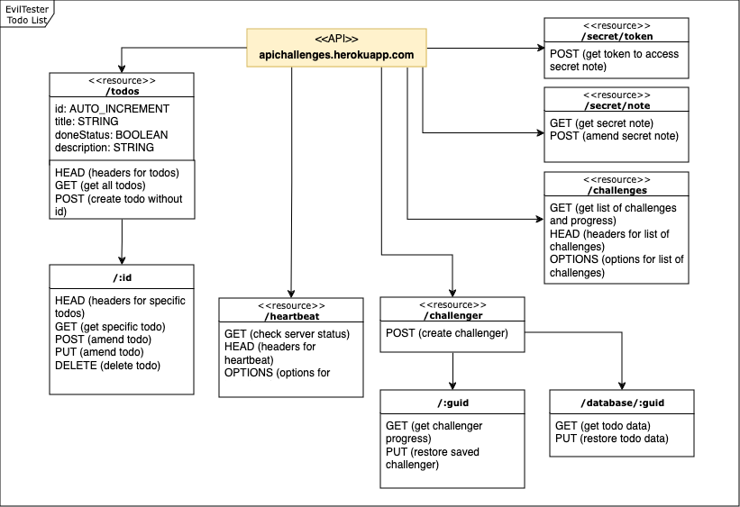

# Todo List API Challenges

## About the project

This project includes my solutions to the evil tester's API challenges. The API is used to manage a To-Do list with simple CRUD (Create, Read, Update, Delete). Although the app is runnable locally, I decided to develop my tests against the public cloud instance (https://apichallenges.herokuapp.com/).

* [About the API challenges](https://apichallenges.herokuapp.com/apichallenges) - information on API challenges and the application.
* [Full list of API challenges](./ListOfChallenges.pdf) - The challenges include get all todos, delete a todo, bad requests etc. 
* [Simple Todo List API documentation](https://apichallenges.herokuapp.com/docs) - documentation on the API endpoints and methods.

Here is a diagram that I made that visualises the API:

## Test Approach

* Simply doing the challenges - Initially I went through the challenges as list. This helped me to learn more about the API, REST methods, different response codes.
* Going beyond the challenges - Now that I finished the challenges, I can think more about how to implement automated checks and other tests beyond the challenges.  

## Tools used

* Bruno v1.17.0 (API client) MacOS version - To read and write API requests and responses, write simple asserts e.g. check for 200 OK.
* API Challenges Progress Tracker - The API challenges website has a page that allows me to track my progress on each challenge.

## Challenges I faced

1. Testing the cloud API instance - The data clears itself every 10 minutes, so this decreases my testing efficiency. Luckily, the API supports the save/restore of session data.

## List of issues found

[See logged issues on the eviltester repo](https://github.com/eviltester/thingifier/issues/created_by/p2635) (this is filtered by the issues that I logged).

## What I learned 

- I learned to use the Bruno API client - configure variables, headers, auth, simple asserts, inspecting response.
